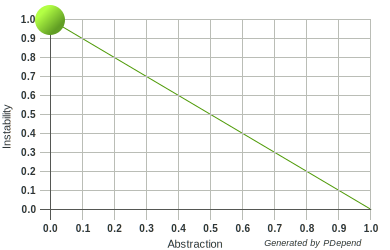
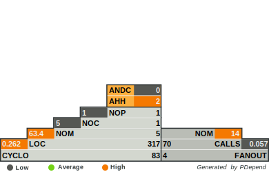
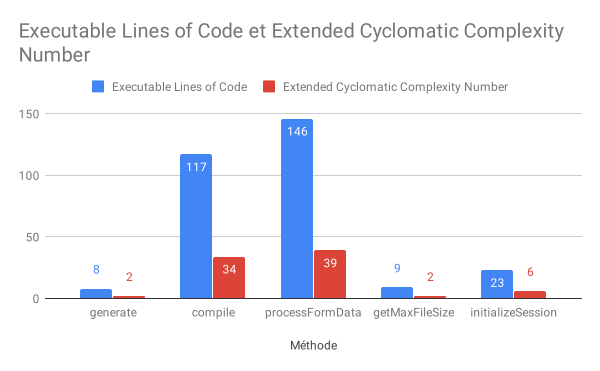
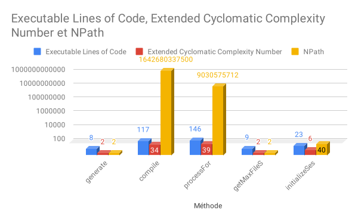

| Thomas Bourrely | Raphael Loussinian |
|-|-|

# Qualification des tests

Tests unitaires, statiques en boite blanche.

# Objectif A - Form.php

## Métriques

* **Executable Lines of Code** : 317
* **Extended Cyclomatic Complexity Number** : 83
* **NPath Complexity** :

| Méthode | npath |
|---------|-------|
| generate | 2 |
| compile | 1642680337500 |
| processFormData | 9030575712 |
| getMaxFileSize | 2 |
| initializeSession | 40 | 

## Métriques par méthode

Plus la valeur de 'Executable Lines of Code' est grande, plus la valeur de 'Extended Cyclomatic Complexity' l'est aussi.

## Avis quant à modification

### generate

Cette méthode semble simple, la modification ne devrait pas poser de problème particulier.

### compile

Cette méthode à des valeurs de 'Extended Cyclomatic Complexity Number' et 'NPath' trop élevées.

La valeur maximum pour ECCN est 10. 34 dépasse donc largement.
Concernant NPath, la valeur recommandée est 200. La valeur obtenue est donc bien trop au-dessus.
Pour finir le nombre de ligne est important.

La modification de cette méthode serait complexe et chronophage.

### processFormData

Comme pour la méthode 'compile', la modification de cette méthode serait complexe et chronophage.

### getMaxFileSize

De manière similaire à la méthode 'generate', la modification semble simple.

### initializeSession

La modification du code de cette méthode semble peu complexe, car les valeurs obtenue sont peu élevées.

## Conclusion objectif A

Certaines de ces méthodes ont des valeurs élevée sur les métriques analysées.

Il serait judicieux d'apporter des modifications au code, afin de le rendre plus lisible et maintenable.

# Objectif B

## Recommandations qualité

Les problèmes remontés peuvent êtres corrigés en utilisant un code style commun sur les ordinateurs des développeurs.

Un travail de code review plus approfondie est nécessaire.

Il est aussi envisageable de former l'équipe aux problématiques de qualité de code.

De plus, afin de palier les erreurs déjà présentes dans le code (npath, cyclomatic complexity, ...) un refactoring permettrait de rendre le code plus maintenable.

En effet, les valeurs de certaines méthodes sont aberrantes.

Pour finir, automatiser ces tests serait bénéfique. Il est possible de le faire en passant par un IDE tel que PHPStorm ou bien intégrer PHPMessDetector à une pipeline CI/CD.

# PHP Depend est-il le bon outil pour contrôler ?

# PHP Mess Detector est-il plus adapté ?
